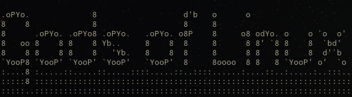

### Gods of linux

This repository holds the code for godsoflinux.com.

### Installation Instructions

##### Pre-requisites
Make sure you have ruby, gems, bundler and jekyll installed.
a guide can be found at the official [jekyll](https://jekyllrb.com/) website.

##### clean
`jekyll clean`

##### build
`jekyll build`

##### run
`bundle exec jekyll serve`

if you would like to watch for your changes and rebuild
`bundle exec jekyll serve --watch`

